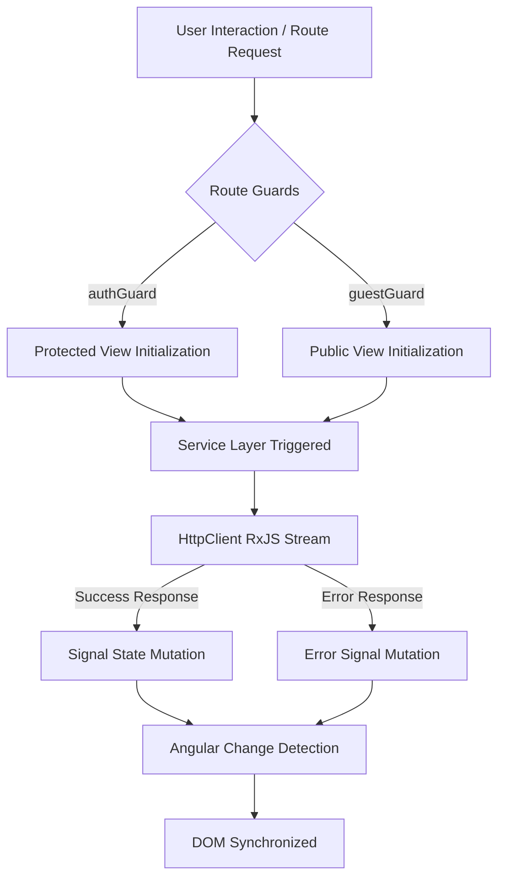

# Link Shortener Frontend Architecture

---

## Technical Breakdown

The application is built on a unidirectional data flow model leveraging **Angular Signals** for state management and **RxJS** for asynchronous network operations.

* **State Management:** Local component state and global service state rely on Angular Signals (`signal`, `computed`). This eliminates memory leaks associated with unhandled subscriptions and forces synchronous DOM updates.
* **Network Layer:** `HttpClient` wraps all API requests in RxJS Observables. Responses are piped through `tap` operators to mutate Signal state before resolving.
* **Routing Security:** Route access is strictly evaluated at the navigation phase using functional Angular Route Guards (`canActivate`).

---

## Application Data Lifecycle

The following chart illustrates the standard execution flow from a user action to a DOM update.

## The Exemption: Anonymous Trial
The system includes a strict bypass for unregistered users. This operates outside the standard authentication lifecycle.

**💡 Core Logic: Guest users interact with a dedicated `/try` service that bypasses the authGuard.**

- Limitation Enforcements
To prevent abuse, limitations are enforced at two distinct levels:

- Client-Side Check: The frontend sets a localStorage marker upon successful creation. Subsequent requests are blocked at the component level.

- Server-Side Check: The API enforces a strict IP-based Time-To-Live (TTL) limit. If the client clears their local storage to bypass the UI block, the network request is still intercepted and rejected by the backend with a 403 Forbidden status.
